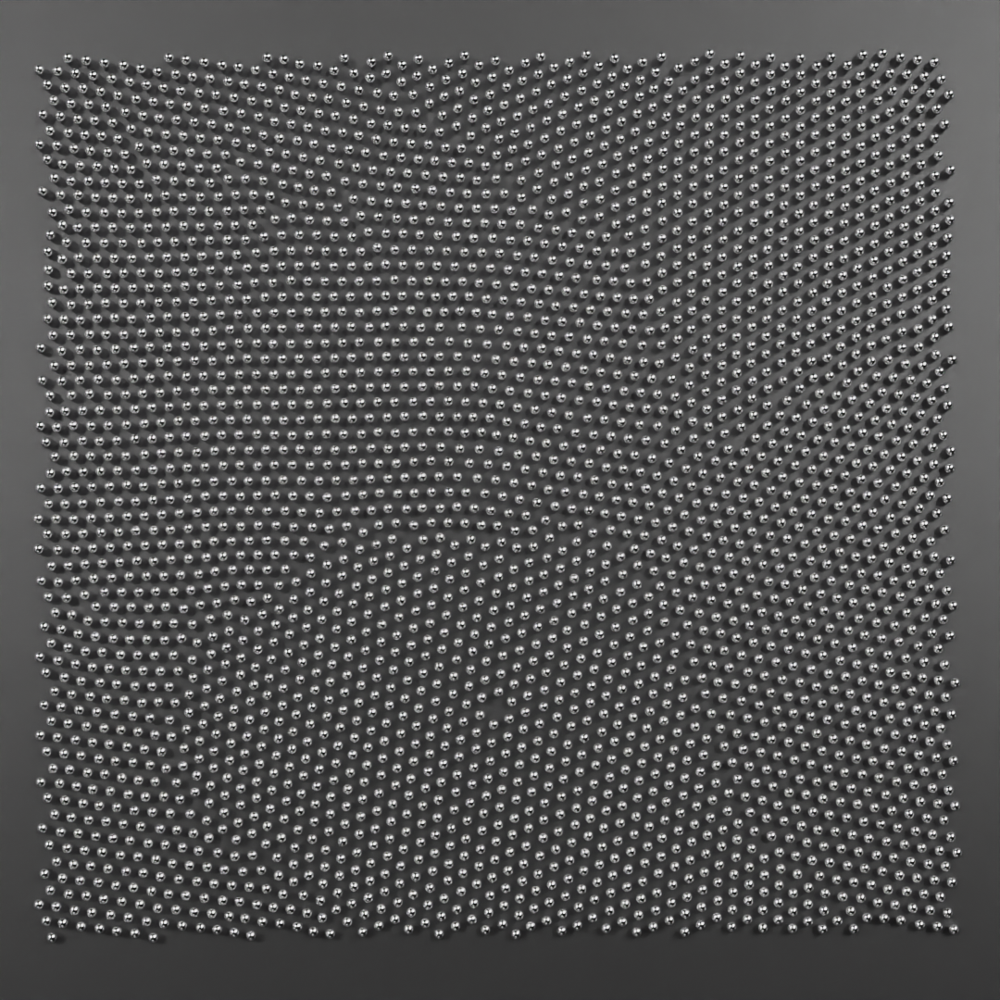
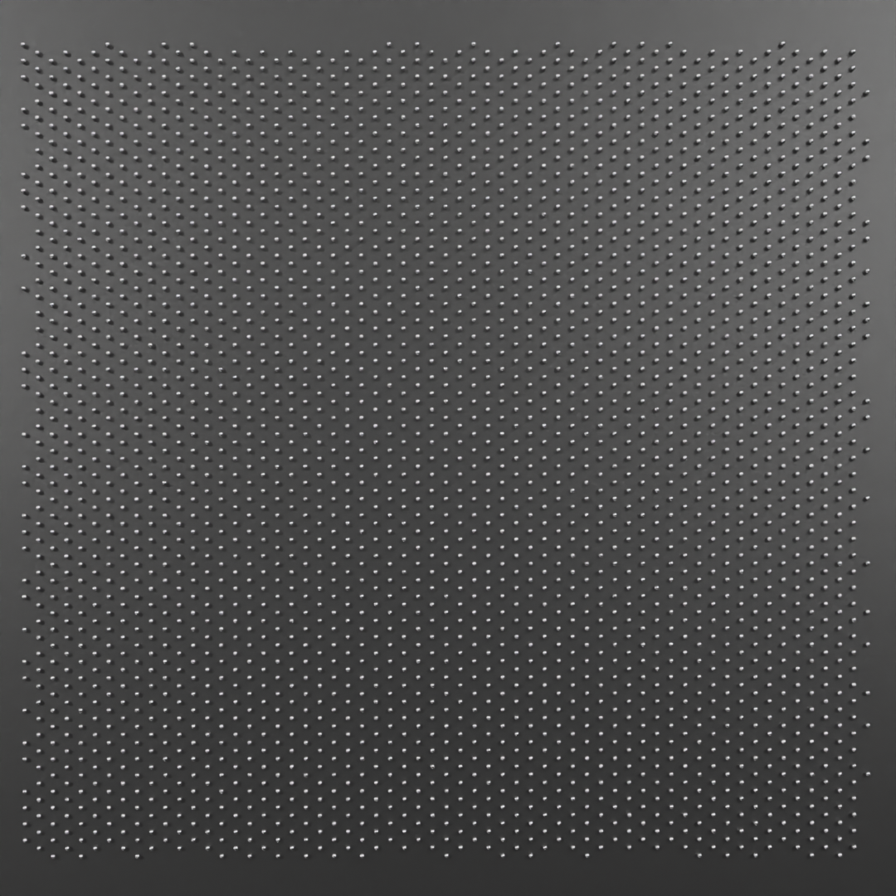
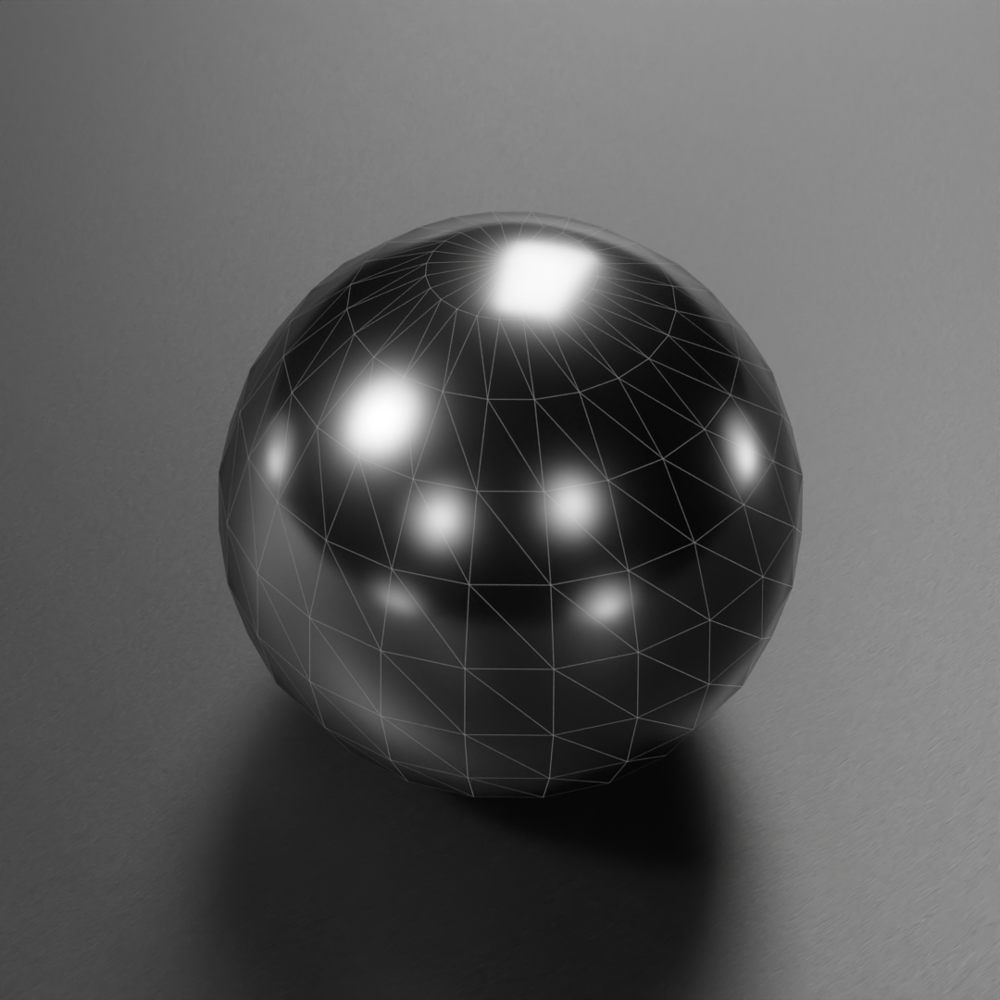

# SciViz Star Projects — Scientific Animation Graphics Contributions
Flagship scientific visualization projects for Technical Arts.
Focus: OVITO→Blender pipelines, PC2 bake, Geometry Nodes instancing, stable renders, scalable particle shapes.

## Projects
- projects/ovito-blender-visualizer — OVITO dump → Blender viewport playback (+ PC2/GN recipes)

- `projects/ovito-blender-visualizer` — OVITO dump → Blender viewport playback (+ PC2/GN recipes)
<video src="docs/media/recocido_720p.mp4"
       width="720"
       autoplay
       loop
       muted
       playsinline
       controls></video>

  

## Demo — Annealing playback

<video src="docs/media/recocido_720p.mp4"
       width="720"
       autoplay
       loop
       muted
       playsinline
       controls></video>

  

## Gallery

**atoms1.png** — Regular lattice of seed points before instancing.  

**atoms2.png** — Distorted lattice after annealing steps (viewport instancing).  

**atoms3.png** — Metal sphere prototype used as the instanced atom.  

---

### Nota sobre autoría y herramientas

La estructuración, diseño de código y parte de la documentación de este repositorio
fueron **asistidos por herramientas de inteligencia artificial**.
Todas las contribuciones generadas con IA fueron **revisadas y validadas por personas**,
siguiendo principios de transparencia, trazabilidad y responsabilidad en software científico.
